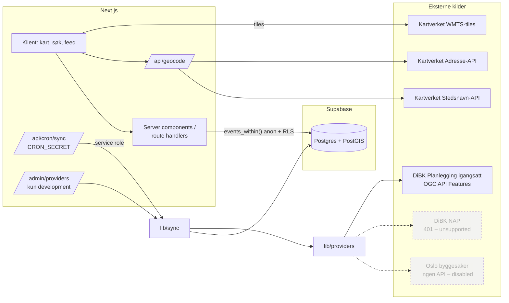
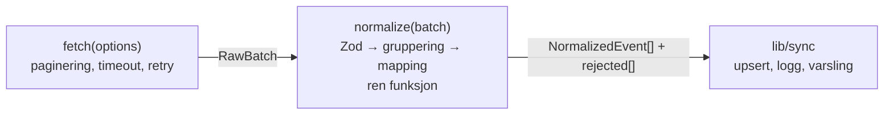
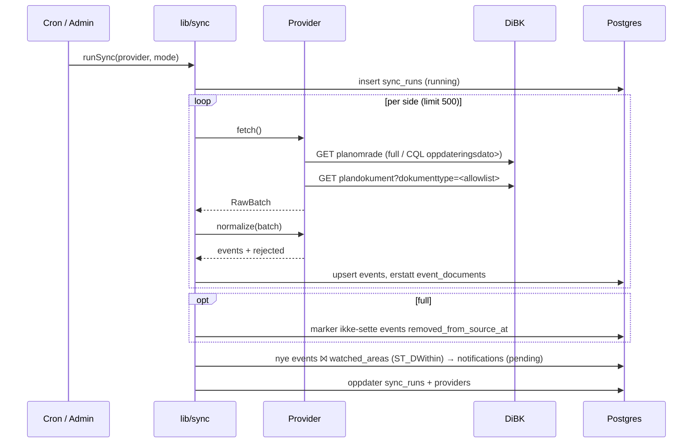
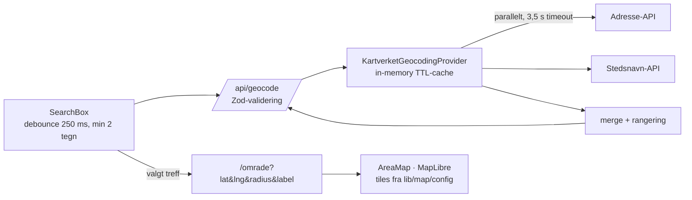
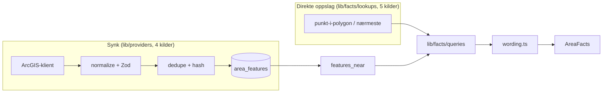

# Arkitektur

NaboRadar henter offentlige plan- og byggedata sentralt, normaliserer dem til én intern modell i Postgres/PostGIS,
og lar brukere spørre «hva skjer innen X meter fra dette punktet?» — uten at søket deres lagres.

Datagrunnlaget er dokumentert i [data-sources.md](data-sources.md). Viktige valg er begrunnet i [ADR-ene](adr/).

## Systemoversikt



## Mappestruktur

| Mappe | Innhold |
|---|---|
| `app/` | Next.js App Router: sider, route handlers (fase 3+) |
| `components/` | UI-komponenter (fase 3+) |
| `lib/providers/` | `DataProvider`-interface, registry, én mappe per kilde (`dibk/`) |
| `lib/sync/` | Orkestrering: fetch → normalize → upsert → logg → varsling |
| `lib/geo/` | Radiusvalg, geo-hjelpere |
| `lib/geocoding/` | `GeocodingProvider` (Kartverket Adresse + Stedsnavn) |
| `lib/map/` | Konfigurerbar kartkilde |
| `lib/notifications/` | `NotificationChannel` (e-postleverandør kobles på senere) |
| `lib/ai/` | Typer for AI-forklaring (ikke implementert) |
| `types/` | Delte domenetyper (`Event`, `EventDocument`) |
| `supabase/migrations/` | SQL-migrasjoner |

## Datamodell

### Event

Se [`types/event.ts`](../types/event.ts). Modellen inneholder kun felt vi har datagrunnlag for.

| Felt | DiBK-kilde | Merknad |
|---|---|---|
| `providerId` + `externalId` | `"dibk-planning-started"` + `arealplan` | Unik nøkkel, dedup |
| `type` | fast `planning_started` | |
| `title` | `plannavn` (trimmet) | |
| `geometry` | alle `planomrade`-polygoner for planen | Polygon eller MultiPolygon |
| `centroid` | beregnet (`ST_PointOnSurface`) | Kun markør/label |
| `computedAreaM2` | beregnet (`ST_Area(geography)`) | Vises som «Beregnet planområde» |
| `municipalityNumber` | `nasjonalArealplanId.kommunenummer` | |
| `municipalityName` | — | DiBK leverer ikke navn. Kan fylles fra kommuneregister senere. |
| `announcedAt` | `kunngjøringsdatoVarselOmPlanoppstart` | Når oppstart ble varslet |
| `sourceUpdatedAt` | max(`oppdateringsdato`) | Når posten sist endret seg i kilden |
| `syncedAt` / `firstSeenAt` | NaboRadar | Når vi hentet / først så saken |
| `removedFromSourceAt` | NaboRadar | Satt ved full sync hvis saken er borte fra kilden |
| `sourceUrl` + `sourceUrlType` | `link` hvis gyldig URL, ellers DiBK-side | Se [Kildelenker](#kildelenker) |
| `attributes` | `plantype`, `planid`, `forslagsstillertype` | Visningsfelt, ingen antakelser |
| `rawData` | `properties` per feature (uten geometri) | Feilsøking |

**Bevisst utelatt:** `purpose`, `validTo`, `status`, `estimatedImpact`, `propertyValueImpact`. Ingen aktiv kilde leverer dem.

**Event-typer:** `planning_started` er aktiv. `building_case`, `regulation`, `regulation_hearing`, `road_work` og `public_hearing`
er reservert i enum og DB-constraint, men har ingen fungerende provider.

### EventDocument

Metadata og lenke til kildedokumenter, aldri innholdet. Allowlist: `ref-data-as-pdf`, `PlanomraadePdf`, `ReferatOppstartsmoete`.

### Database

```mermaid
erDiagram
  providers ||--o{ events : leverer
  providers ||--o{ sync_runs : logger
  events ||--o{ event_documents : har
  events ||--o{ notifications : utløser
  watched_areas ||--o{ notifications : mottar
  auth_users |o--o{ watched_areas : eier

  providers { text id PK; text status; text status_reason; text license_name; timestamptz last_sync_at; timestamptz last_success_at; text last_error }
  events { uuid id PK; text provider_id FK; text external_id "UNIQUE med provider_id"; text type; text title; geometry geom "4326"; geometry centroid "generert"; float computed_area_m2 "generert"; date announced_at; timestamptz source_updated_at; timestamptz synced_at; timestamptz removed_from_source_at; text source_url; jsonb attributes; jsonb raw_data; text content_hash }
  event_documents { uuid id PK; uuid event_id FK; text external_id; text type "CHECK allowlist"; text title; text url; text mime_type; date document_date }
  sync_runs { uuid id PK; text provider_id FK; text mode; text status; int fetched; int inserted; int updated; int unchanged; int removed; int failed; text error }
  watched_areas { uuid id PK; uuid user_id "nullable"; text name; text address_label; float latitude; float longitude; int radius_m; geography point "generert" }
  notifications { uuid id PK; uuid watched_area_id FK; uuid event_id FK; text status; text channel; timestamptz sent_at }
```

Migrasjon: [`supabase/migrations/20260921000000_init.sql`](../supabase/migrations/20260921000000_init.sql).
Det finnes ingen egen `users`-tabell; Supabase `auth.users` brukes.

## Geospatial strategi

Detaljer i [ADR 002](adr/002-postgis-geospatial-model.md).

- Lagring: `geometry(Geometry, 4326)` — samme lon/lat som DiBK (CRS84) og webkart, ingen transformasjon.
- Radius: `ST_DWithin(geom::geography, punkt::geography, radius_m)` gir korrekte meter på ellipsoiden.
  En funksjonell GiST-indeks på `(geom::geography)` gjør at spørringen bruker indeks (verifisert med `EXPLAIN`).
- Kriteriet er «polygonet ligger helt eller delvis innen radius». Centroid og polygonhjørner brukes ikke til filtrering.
- `distance_m = ST_Distance(geom::geography, punkt)` → 0 når punktet ligger inni polygonet.
- `events_within(lat, lng, radius_m, announced_since, include_removed)` er den eneste spørringen UI-et trenger for feeden.

Verifisert med ekte DiBK-polygoner rundt Majorstuen (PGlite + PostGIS):

| Plan | Avstand til polygon | Avstand til centroid |
|---|---|---|
| Sørkedalsveien 10 m.m. | 238 m | 339 m |
| Bjørnstjerne Bjørnsons plass 1 m.fl. | **422 m** | **592 m** |
| Thaulows vei 19-25 | 569 m | 711 m |

Med 500 m radius ville en centroid-basert løsning feilaktig utelatt Bjørnstjerne Bjørnsons plass.

## Provider-arkitektur

Se [ADR 001](adr/001-provider-architecture.md) og [`lib/providers/types.ts`](../lib/providers/types.ts).



- En provider er en ren adapter. Den skriver aldri til databasen.
- `normalize` tar en hel batch fordi DiBK må slå sammen flere features til ett event.
- Ugyldige poster havner i `rejected[]`, blir logget og stopper ikke syncen.
- Status: `active` | `disabled` | `unsupported` | `error`. Koden har `defaultStatus`; `providers`-tabellen kan overstyre (f.eks. slå av en aktiv provider). `error` settes av sync-laget.

| Provider | Status | Grunn |
|---|---|---|
| `dibk-planning-started` | active | Åpen, NLOD 2.0 |
| `dibk-regulation` | unsupported | 401, Norge Digitalt |
| `dibk-regulation-proposal` | unsupported | 401, Norge Digitalt |
| `oslo-building-case` | disabled | Ingen dokumentert API ([ADR 004](adr/004-no-scraping-oslo.md)) |

### DiBK-normalisering og deduplisering

1. Valider hver `planomrade`-feature med Zod. Ugyldige features går til `rejected`.
2. Grupper på `properties.arealplan` (heltall, forelder-ID). **Aldri på plannavn** — samme navn brukes flere steder.
3. Én polygon gir `Polygon`, flere gir `MultiPolygon`. Ved upsert kjøres `ST_MakeValid`, og `ST_Multi` ved behov.
4. `externalId = String(arealplan)`. Upsert på `(provider_id, external_id)`; DB-en har `UNIQUE`.
5. `content_hash` = hash av normalisert event (inkl. geometri og dokumenter). Lik hash gir `unchanged`, ellers `updated`.
6. Et nytt varsel for samme prosjekt får ny `arealplan`-ID i kilden og blir derfor et eget event. Vi kan ikke bevise at to varsler er samme sak. En «relatert sak»-kobling kan eventuelt lages senere.

### Kildelenker

1. DiBK `link` brukes bare hvis `toSafeHttpUrl()` godtar den (fullstendig `http(s)://`). Da blir typen `municipal`.
2. Ellers: `…/collections/arealplan/items/{arealplan}?f=html` (verifisert 200), med typen `provider_page`.
3. Vi konstruerer aldri kommunale URL-er og reparerer aldri fritekst.
4. Databasen har en `CHECK` som avviser `source_url` uten `http(s)://`.

## Sync-strategi

Se [ADR 003](adr/003-central-data-sync.md).



- **Full:** ca. 3 900 features (8 sider) + ca. 3 300 tillatte dokumenter (7 sider), hentet med `?dokumenttype=` per type.
- **Incremental:** `filter=oppdateringsdato>'{siste suksess − 1 dag}'`. For hver berørt `arealplan` hentes alle dens features (`?arealplan=`), slik at ingen polygoner mistes.
- **Anbefalt frekvens:** incremental hver 2. time, full reconciliation hver natt. Begrunnelse i ADR 003.
- **HTTP:** 20 s timeout, 3 retries med eksponentiell backoff og jitter på nettverksfeil og 5xx. Ingen retry på 4xx.

## Geokoding og kart (fase 3)



- `GeocodingProvider` er implementert som `KartverketGeocodingProvider`. Feiler én kilde, returneres treff fra den andre. Feiler begge, kastes `GeocodingUnavailableError`, og API-et svarer 503.
- Radius tegnes som en geodetisk polygon (`lib/geo/radius.ts`). Samme meter-semantikk som `ST_DWithin` på serveren.
- `/omrade` er en server component: validerer parametre og sender kartkonfig til en klientkomponent. Kartet lastes dynamisk, bare i nettleseren.
- Tekniske valg som avviker fra fase 2:
  - TypeScript er låst til 6.0.x. TypeScript 7 mangler JS-API-et som `typescript-eslint` og Next.js-typesjekken bruker.
  - ESLint 9, fordi `eslint-plugin-react` ikke støtter 10.
  - MapLibre-workeren serveres fra `public/vendor/`.

## Fase 4: implementasjon og avvik fra fase 2

Arkitekturen fra fase 2 er beholdt. Konkrete justeringer:

| Fase 2 | Fase 4 | Hvorfor |
|---|---|---|
| `normalize()` grupperer | `normalize()` returnerer ett fragment per feature. `lib/sync/merge.ts` grupperer på `(providerId, externalId)` | Grupper kan krysse sidegrenser, og sammenslåing er generisk på tvers av providers |
| Polygon eller MultiPolygon | Alltid MultiPolygon for polygon-events (`ST_Multi(ST_CollectionExtract(ST_MakeValid(g), 3))`) | Én form, gyldig geometri, og ingen dobbelttelling av areal ved overlapp |
| Skriving via tabell-API | All skriving via SQL-funksjoner: `upsert_events`, `mark_removed_from_source`, `sync_run_start` og `sync_run_finish` | Samme kall mot Supabase (`rpc`) og PGlite. EXECUTE er trukket fra anon/authenticated |
| — | `Db`-grensesnitt (`lib/db`) med `SupabaseDb` og `PgliteDb` | Lokal dev og tester uten Docker, med de samme migrasjonene |
| `events_within(… include_removed)` | `events_within(lat, lng, radius_m, announced_since, sort, max_results)`. Fjernede events er alltid utelatt, og GeoJSON har 6 desimaler | Sortering i SQL, mindre payload |
| — | `get_event(id, lat?, lng?)`, `data_status()` (offentlig) og `provider_overview()` (service role) | Detaljside, «data ikke hentet ennå» og `/dev` |
| `sync_runs` | + `accepted`, `rejected` | Skiller valideringsavvisning fra skrivefeil |

### Sync-status

| Status | Betydning |
|---|---|
| `success` | Alt hentet og skrevet. Avviste features er et datakvalitetsproblem, ikke en feil |
| `partial` | Noen rader kunne ikke skrives (se `errors`). Reconciliation kjøres, men feilede id-er beskyttes |
| `failed` | Fatal feil (side, nettverk, DB). Ingen reconciliation, så ingenting markeres som fjernet |

### Kart: lag-konsept

`components/map/AreaMap.tsx` er en generisk vert. Datalag implementerer `MapLayer<T>` (`lib/map/layers/`), med disse metodene:

| Metode | Hva den gjør |
|---|---|
| `mount` | Legger laget inn i kartet |
| `update` | Oppdaterer data |
| `interactiveLayerIds` / `idFromFeature` | Gjør laget klikkbart og gir id for klikket objekt |
| `setSelected` | Markerer valgt objekt |

Dagens lag er `radiusLayer` (søkepunkt og sirkel) og `planAreasLayer` (planpolygoner og punkt for små områder, med valgt-tilstand via `feature-state`). Byggesaker, reguleringsplaner, veiarbeid og eiendommer blir nye lag uten endring i kartkomponenten.

### Resultatsiden

`/omrade` er en server component som validerer URL-en og kaller `events_within`. `AreaExplorer` (klient) eier valgt sak, som deles mellom kart og feed. Radius, sortering og sted endres via URL i en React-transition. Feeden viser da «Oppdaterer …», mens kartet beholdes og bare får nye data og nytt utsnitt.

## Områdefakta (fase 5)

Plansaker er **hendelser** (dato, forsvinner ikke), områdefakta er **tilstander** (ingen dato). De ligger derfor i hver sin tabell, men deler sync-maskineriet.



| Beslutning | Valg | Hvorfor |
|---|---|---|
| Egen tabell | `area_features` med `category`, `subtype`, `attributes jsonb` | Tilstander uten dato, egen spørring, ingen blanding med events |
| Synk vs direkte | Synk under ~30 k objekter, ellers direkte oppslag | Strategisk støy er ~300 MB, kvikkleire-aktsomhet 148 k polygoner, distribusjonsnett 141 k linjer |
| Avstand og «innenfor» | `features_near` gir `distance_m` og `contains` i samme rad | Kravet om å vise begge deler |
| Tekst | Sentralt register (`lib/facts/wording.ts`) | Ingen setninger bygges i UI-et; ukjent subtype vises ikke |
| Attributter | Kun kodede verdier | Fritekstfelt kan inneholde gnr./bnr. og personnavn |
| Generalisering | `maxAllowableOffset ≈ 1 m` for kvikkleire | Største sone har 125 000 hjørner og sprengte skrivetiden |
| Oppdeling | Flerdelte geometrier over 150 kB deles i flere rader | «Område uten fare» har opptil 1 935 deler (2,3 MB) |
| Skrivepakker | Både rad- og bytegrense (`strategy.chunkSize`, `maxChunkBytes`) | Supabase har kort statement timeout; `SET LOCAL` kan ikke forlenge et kall som allerede kjører |

### Sync-generalisering

`runSync` er nå generisk: provideren oppgir `recordKind` («event» eller «area_feature»), og `lib/sync/strategy.ts` bestemmer gruppering, hash, radformat og hvilke SQL-funksjoner som brukes. Henting, validering, tellere, `sync_runs`, reconciliation og `/dev` er felles.

### Presentasjonsregler som er kodet

- Forurenset grunn vises som fordeling på påvirkningsgrad, ikke som et rått antall. Bare lokaliteter der kilden sier «behov for tiltak», eller som omfatter søkepunktet, løftes fram.
- Kvikkleire: aktsomhetsområde, kartlagt sone og klassifisering er tre ulike utsagn. «Mulig» skilles fra «påvist», sikringstiltak vises, og klassifiseringen merkes som sonens.
- Støy: dB-intervall fra strategisk kartlegging, gul/rød sone fra T-1442, med kildens eget forbehold.
- Objekter som ligger som flere rader (oppdelte soner, kraftledninger i segmenter) vises som ett faktum — det nærmeste.

## Alder og «nye» saker

Kilden har ingen status eller sluttdato. Produktet viser som standard saker varslet de siste **24 månedene**
(`DEFAULT_ANNOUNCED_WITHIN_MONTHS`). Dette er et filter i visningen (`announced_since`) — ingenting slettes.
UI-et skal formulere seg etter dette, for eksempel «Oppstart varslet for 8 måneder siden», og aldri «pågår».

## Server/klient-grenser

| Hvor | Hva |
|---|---|
| **Klient** | MapLibre-kart, autocomplete-input, radiusvalg, feed-interaksjon |
| **Server (RSC / route handlers)** | `/api/geocode` (proxy og cache mot Kartverket), resultat- og detaljsider via `events_within()` med anon-nøkkel og RLS |
| **Kun server, hemmelig** | `SUPABASE_SERVICE_ROLE_KEY`, sync, `/api/cron/sync` (krever `CRON_SECRET`), `/admin/providers` (kun `NODE_ENV=development` eller `ADMIN_TOKEN`) |
| **Database** | Geo-spørringer, dedup-constraints, dokument-allowlist, RLS |
| **Cron** | Vercel Cron eller Supabase `pg_cron` kaller `/api/cron/sync` |

Klienten kaller aldri DiBK direkte. Kartverket-tiles hentes direkte av nettleseren, siden de er offentlige og cachede.

## Personvern

| Tiltak | Hvor |
|---|---|
| Berørte parter hentes aldri: dokumenter forespørres kun med `?dokumenttype=` fra allowlisten | `lib/providers/dibk` |
| Dobbel sikring: `isAllowedDocument()` + DB `CHECK` på type, tittel og mime | kode + migrasjon |
| `raw_data` inneholder kun plan-`properties`, ikke dokumentinnhold eller geometri-duplikat | normalisering |
| Søk logges ikke. Adressen ligger bare i URL-en som `lat`/`lng`/`radius` | `/api/geocode`, sider |
| En søkt adresse antas aldri å være brukerens bolig | produkt |
| `watched_areas` opprettes kun ved eksplisitt «Følg dette området» | produkt + RLS |
| Brukerdata leses kun av eier (RLS `auth.uid()`) | migrasjon |

## AI (senere)

`lib/ai` får `summarizeEvent(event)`. Sammendrag lages **on-demand** når brukeren trykker «Hva betyr dette?», og caches per
`(event_id, content_hash)`. Input er normalisert event og metadata for tillatte dokumenter. Vi sender aldri `raw_data` ukritisk,
og aldri berørte parter. Sammendraget vises alltid adskilt fra og merket annerledes enn offentlige kildedata.

## Kjente begrensninger

- DiBK har verken formål, status, sluttdato eller kommunenavn.
- `link` er ofte tom, så mange saker lenker til DiBK-siden i stedet for kommunens saksinnsyn.
- DiBK-API-et er `0.23.dev0`. `sortby` ignoreres og `datetime` feiler. Alt valideres med Zod.
- Datasettet dekker varsler fra 2024 og fremover, og ikke alle kommuner rapporterer.
- Byggesaker, reguleringsplaner og høringer mangler inntil lovlig kilde finnes.

## Fremtidige providers

| Provider | Hva må til |
|---|---|
| `dibk-regulation` / `dibk-regulation-proposal` | Norge Digitalt-avtale eller åpen lisens → ny klasse, status `active` |
| `oslo-building-case` | Dokumentert offentlig API fra Oslo kommune |
| `road_work` (gravemeldinger) | Kilde ikke undersøkt |
| Andre kommuner | Via DiBK (nasjonalt) eller egne dokumenterte API-er |

**Legge til en ny kilde:** undersøk og dokumenter i `data-sources.md`, lag `lib/providers/<kilde>/` med Zod-skjema og en
`DataProvider`-klasse, registrer den i `registry.ts`, legg inn en seed-rad i en ny migrasjon, og utvid `event_documents.type`-CHECK hvis kilden har dokumenter.
